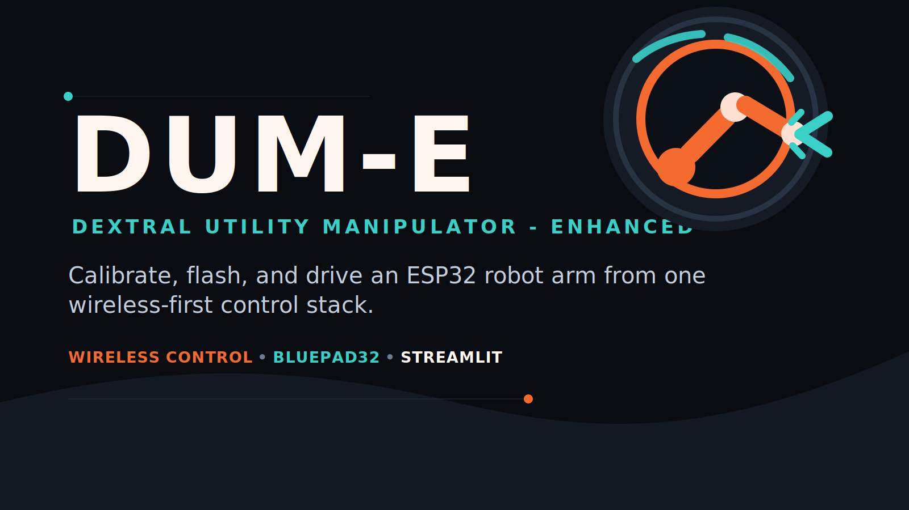

## Overview

DUM-E is an ESP32-based robot arm controller with:

- Per-joint calibration stored in flash
- Mixed support for 180-degree positional servos and continuous/360-degree servos
- A Streamlit dashboard for calibration, manual motion, Wi-Fi setup, and controller mapping
- Wireless gamepad pairing through Bluepad32

## Project layout

- `robot_arm.ino`: ESP32 firmware
- `streamlit_app.py`: Streamlit control dashboard
- `launcher.py`: Windows desktop launcher
- `launcher.spec`: PyInstaller build spec for the Windows app bundle
- `branding/`: logo, icon, banner, social card, and brand guide assets
- `requirements.txt`: Python dashboard dependencies
- `scripts/install_python_deps.ps1`: installs the Python dependencies
- `scripts/install_bluepad32_core.ps1`: installs the Bluepad32 Arduino core with the Arduino CLI bundled with Arduino IDE
- `scripts/build_launcher.ps1`: builds the Windows launcher bundle

## Windows launcher

Build the bundled Windows app:

```powershell
pwsh -ExecutionPolicy Bypass -File .\scripts\build_launcher.ps1
```

Output:

- `dist\DUM-E Launcher\DUM-E Launcher.exe`

The launcher can:

- install / repair the `ESP32 + Bluepad32` core
- detect COM ports
- compile and flash the ESP32
- launch the dashboard without manually running Streamlit commands

## Python setup

```powershell
pwsh -ExecutionPolicy Bypass -File .\scripts\install_python_deps.ps1
```

Run the dashboard:

```powershell
python -m streamlit run .\streamlit_app.py
```

## Arduino / ESP32 setup

Install the Bluepad32 ESP32 core:

```powershell
pwsh -ExecutionPolicy Bypass -File .\scripts\install_bluepad32_core.ps1
```

Then compile with:

```powershell
& 'C:\Program Files\Arduino IDE\resources\app\lib\backend\resources\arduino-cli.exe' compile --fqbn esp32-bluepad32:esp32:esp32 .
```

Upload to `COM4`:

```powershell
& 'C:\Program Files\Arduino IDE\resources\app\lib\backend\resources\arduino-cli.exe' upload -p COM4 --fqbn esp32-bluepad32:esp32:esp32 .
```

## First run

1. Flash the ESP32.
2. Power the arm.
3. Connect to the setup AP `RobotArm-Setup` if Wi-Fi is not configured yet.
4. Open the dashboard and connect to the ESP32 URL.
5. Configure each DOF:
   - positional 180-degree servo, or
   - continuous 360-degree servo
6. Save calibration to flash.

## Controller pairing

1. In the dashboard, turn on `Allow new wireless pairing`.
2. On the DualShock 4, hold `SHARE + PS` until the light flashes rapidly.
3. Refresh the dashboard.
4. Once paired, turn pairing mode off if you only want remembered controllers to reconnect.

## Notes on motor types

- `positional_180`:
  - dashboard move slider = target angle
  - controller axis input = absolute target angle
- `continuous_360`:
  - dashboard move slider = speed command
  - `0` means stop
  - controller axis input = absolute speed command

## Tested local commands

- Python syntax:

```powershell
python -m py_compile .\streamlit_app.py
```

- Firmware compile:

```powershell
& 'C:\Program Files\Arduino IDE\resources\app\lib\backend\resources\arduino-cli.exe' compile --fqbn esp32-bluepad32:esp32:esp32 .
```
